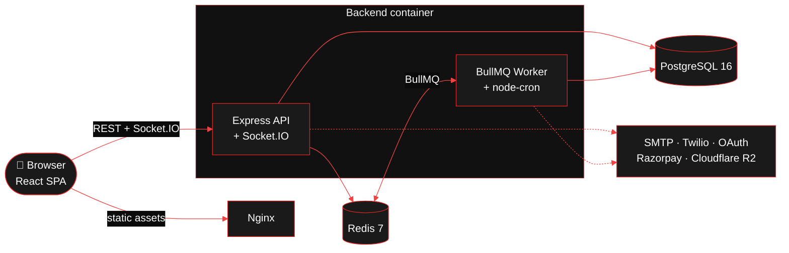
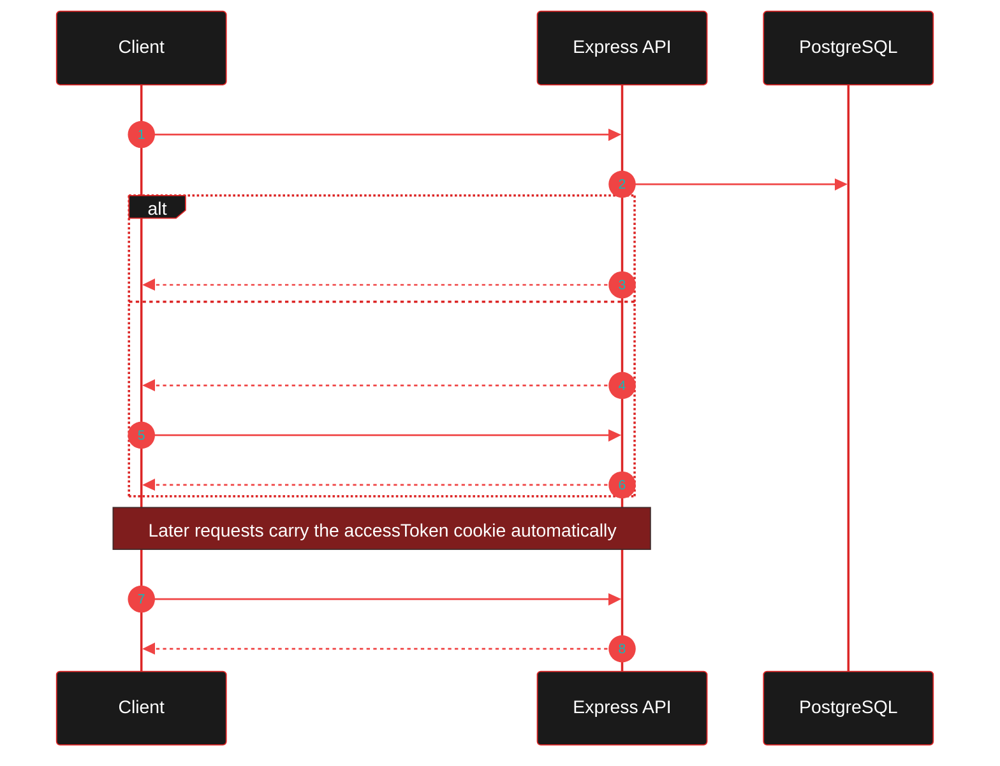

<p align="center">
  
</p>

<p align="center">
  <a href="https://github.com/iamabhiram-v">
    
  </a>
</p>

<p align="center">
  <a href="https://www.linkedin.com/in/abhiram-v-297188364/"></a>
  &nbsp;
  <a href="TODO_PORTFOLIO_URL"></a>
  &nbsp;
  <a href="https://github.com/iamabhiram-v"></a>
</p>

<p align="center">
  
  
  
  
  
</p>


<h2 align="center">👨‍💻 &nbsp;Who I Am</h2>

```ts
const abhiram = {
  name: "Abhiram V",
  role: "Full Stack Developer Intern @ Richinnovations",
  studying: "MCA in Cyber Security & AI (Amrita Vishwa Vidyapeetham)",
  building: "RoleGuard — RBAC & workspace collaboration platform",
  stack: ["TypeScript", "React", "Node.js", "Express", "PostgreSQL", "Redis"],
  security: ["Burp Suite", "Nmap", "Gobuster", "Metasploit", "OWASP Top 10"],
  goal: "HTB Certified Penetration Testing Specialist (CPTS)",
  approach: "Build it properly, then attack it to see if it holds.",
  motto: "Always learning. Always building. Always securing.",
} as const;
```

<p align="center">
  I'm an aspiring <b>Application Security Engineer</b>. Working as a developer teaches me how applications are put together, so when I switch to the attacker's seat, I already know where the weak spots hide: <b>APIs, authentication, and access control</b>.
</p>

<table width="100%" border="0" align="center">
<tr>
<td width="33%" align="center" style="padding: 14px;">
  <h4>💼 Now</h4>
  <p><b>Richinnovations</b><br /><sub>Full Stack Developer Intern<br />Jun 2026 – Present</sub></p>
</td>
<td width="33%" align="center" style="padding: 14px;">
  <h4>🎓 Studying</h4>
  <p><b>MCA · Cyber Security</b><br /><sub>Amrita Vishwa Vidyapeetham<br />Starting Oct 2026</sub></p>
</td>
<td width="33%" align="center" style="padding: 14px;">
  <h4>🎯 Next Milestone</h4>
  <p><b>HTB CPTS</b><br /><sub>Hack The Box<br />Penetration Testing Specialist</sub></p>
</td>
</tr>
</table>


<h2 align="center">🔐 &nbsp;Featured Project: RoleGuard</h2>

<p align="center">
  <i>A role-based access control and workspace collaboration platform, built during my internship at Richinnovations.<br />
  Authentication, workspaces, background jobs, real-time presence, payments, and admin monitoring in one system.</i>
</p>

<p align="center">
  <a href="TODO_ROLEGUARD_URL"></a>
  &nbsp;&nbsp;
  <a href="TODO_ROLEGUARD_REPO"></a>
</p>

<p align="center">
  
  
  
  
</p>

<table width="100%" border="0" align="center">
<tr>
<td width="33%" valign="top" style="padding: 12px;">
  <h4>🔑 Authentication</h4>
  <sub>
  JWT access + refresh tokens in <b>httpOnly cookies</b><br />
  Optional email-OTP two-factor login<br />
  bcrypt hashing, Zod validation<br />
  Google, GitHub &amp; Microsoft OAuth
  </sub>
</td>
<td width="33%" valign="top" style="padding: 12px;">
  <h4>🛡️ Access Control</h4>
  <sub>
  Platform roles: Admin / User<br />
  Workspace roles: Owner / Admin / Member<br />
  Middleware + service-layer enforcement<br />
  Rate-limited auth &amp; account endpoints
  </sub>
</td>
<td width="33%" valign="top" style="padding: 12px;">
  <h4>👥 Workspaces</h4>
  <sub>
  Email invitations with accept / decline<br />
  Role changes &amp; ownership transfer<br />
  Leave and delete flows<br />
  Live presence &amp; typing indicators
  </sub>
</td>
</tr>
<tr>
<td width="33%" valign="top" style="padding: 12px;">
  <h4>⚙️ Background Jobs</h4>
  <sub>
  BullMQ on Redis: email, SMS, notifications<br />
  Exponential-backoff retries<br />
  Hold / release, pause / resume<br />
  Admin queue monitor
  </sub>
</td>
<td width="33%" valign="top" style="padding: 12px;">
  <h4>🔔 Notifications</h4>
  <sub>
  Real-time in-app notification center<br />
  Per-category preferences &amp; mute windows<br />
  Web push subscriptions<br />
  Admin announcements
  </sub>
</td>
<td width="33%" valign="top" style="padding: 12px;">
  <h4>📊 Admin &amp; Ops</h4>
  <sub>
  Analytics with CSV / JSON / PDF export<br />
  Service status dashboard<br />
  Liveness &amp; readiness health checks<br />
  Winston logging, PostgreSQL backups
  </sub>
</td>
</tr>
</table>

<h3 align="center">🏗️ Architecture</h3>



<h3 align="center">🔄 Login Flow (optional 2FA)</h3>



<details>
<summary><b>📚 &nbsp;Full documentation package (click to expand)</b></summary>
<br />

I documented RoleGuard end to end in a 62-page package covering:

| Section | Covers |
|---|---|
| 🏛️ **System Architecture** | Components, data flows, security architecture, scalability notes |
| 🗄️ **Database Design** | ER diagram, all 15 tables, cascade and indexing strategy |
| 🔌 **API Documentation** | REST + Socket.IO reference, status codes, rate limits |
| 🚢 **Deployment Guide** | Environment setup, Docker builds, health checks, rollback, backup and restore |
| 📖 **User Manual** | Roles, workspaces, notifications, admin tools |

</details>


<h2 align="center">🛡️ &nbsp;Security</h2>

```bash
$ nmap -sV target            # networking fundamentals + service discovery
$ gobuster dir -u target     # content discovery
$ burpsuite                  # intercept, replay, tamper
$ msfconsole                 # Metasploit Framework
$ john hashes.txt            # John the Ripper
```

<table width="100%" border="0" align="center">
<tr>
<td width="50%" valign="top" style="padding: 12px;">
  <h4>🕷️ Web &amp; API Security</h4>
  <sub>
  OWASP Top 10 &amp; web application security<br />
  API security<br />
  SQL injection &amp; Cross-Site Scripting (XSS)<br />
  Authentication &amp; authorization testing
  </sub>
</td>
<td width="50%" valign="top" style="padding: 12px;">
  <h4>🧰 Tooling &amp; Labs</h4>
  <sub>
  Kali Linux, Burp Suite, Gobuster, Nmap<br />
  Metasploit &amp; John the Ripper<br />
  Active Directory attacks, Kerberoasting, BloodHound<br />
  Practised in labs and on my own apps
  </sub>
</td>
</tr>
</table>

<p align="center">
  
  &nbsp;
  
  
  
  
  
  
</p>

<p align="center">
  <b>Goal:</b> Hack The Box <b>CPTS</b> (Certified Penetration Testing Specialist)<br />
  <sub>All testing is done in labs, on my own systems, or where I have explicit authorization.</sub>
</p>


<h2 align="center">🛠️ &nbsp;Development Stack</h2>

<p align="center"><b>Languages</b></p>
<p align="center">
  
  &nbsp;
  
</p>

<p align="center"><b>Frontend</b></p>
<p align="center">
  
  &nbsp;
  
</p>

<p align="center"><b>Backend &amp; Data</b></p>
<p align="center">
  
  <br /><br />
  
  
  
  
  
  
</p>

<p align="center"><b>Integrations</b></p>
<p align="center">
  
  
  
  
</p>

<p align="center"><b>Deployment</b></p>
<p align="center">
  
</p>


<h2 align="center">🧭 &nbsp;Journey</h2>

<table width="100%" border="0" align="center">
<tr>
<td width="33%" align="center" style="padding: 14px;">
  <h4>2023 – 2026</h4>
  <p><b>BCA</b><br /><sub>University of Kerala<br />Thiruvananthapuram</sub></p>
</td>
<td width="33%" align="center" style="padding: 14px;">
  <h4>Jun 2026 → Now</h4>
  <p><b>Full Stack Developer Intern</b><br /><sub>Richinnovations<br />Technopark, Thiruvananthapuram (Remote)</sub></p>
</td>
<td width="33%" align="center" style="padding: 14px;">
  <h4>Oct 2026 →</h4>
  <p><b>MCA · Cyber Security &amp; AI</b><br /><sub>Amrita Vishwa Vidyapeetham</sub></p>
</td>
</tr>
</table>


<h2 align="center">🎯 &nbsp;How I Work</h2>

<p align="center">
  <b>Correctness</b> → <b>Security</b> → <b>Reliability</b> → <b>Maintainability</b> → <b>Testability</b> → <b>Performance</b> → <b>Simplicity</b>
</p>

<p align="center">
  <i>Understand before changing. Verify before claiming. Prefer the simplest production-safe solution.</i>
</p>


<h2 align="center">📊 &nbsp;GitHub Activity</h2>

<p align="center">
  
  &nbsp;&nbsp;
  
</p>

<p align="center">
  
</p>

<p align="center">
  
</p>


<h2 align="center">📬 &nbsp;Let's Connect</h2>

<p align="center">
  <i>Open to conversations about application security, web &amp; API testing, and building things properly.</i>
</p>

<p align="center">
  <a href="https://www.linkedin.com/in/abhiram-v-297188364/"></a>
  &nbsp;
  <a href="https://github.com/iamabhiram-v"></a>
</p>

<p align="center"><b><i>Always learning. Always building. Always securing.</i></b></p>

<p align="center">
  
</p>
